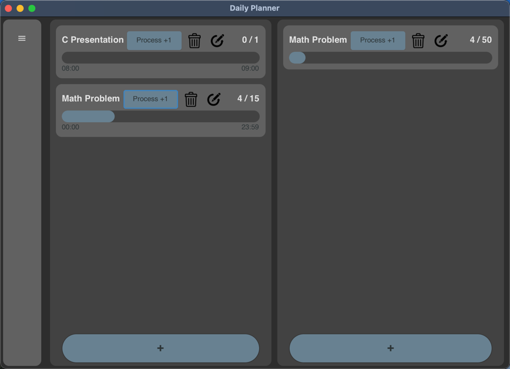

# C-program
---
## The Latest Presention Files (Please download here)
[Document](https://github.com/IMFAat/C-program/blob/main/Presentation/Document.pdf)

[Slides](https://github.com/IMFAat/C-program/blob/main/Presentation/Slides.pdf)

---
## Snapshots (On macOS)
### Main Screen

### Added Activity

### Drawer Expended

### Bottom Add Activity Menu

---
## How to run the project
### Step 1
Clone the project
### Step 2

---
## CMakeList.txt
```aiignore
add_definitions(-DROOT_PATH="${CMAKE_BINARY_DIR}")
```
```aiignore
add_custom_target(copy_ui_file ALL
        COMMAND ${CMAKE_COMMAND} -E remove_directory ${CMAKE_BINARY_DIR}/src
        COMMAND ${CMAKE_COMMAND} -E copy_directory ${CMAKE_SOURCE_DIR}/src ${CMAKE_BINARY_DIR}/src
)
```

```aiignore
add_executable(FinalProject MACOSX_BUNDLE main.c
        Screens/MainScreen/MainScreen.c
        Screens/MainScreen/MainScreen.h
        sqlite/daily/daily.h
        sqlite/daily/daily.c
        sqlite/weekly/weekly.h
        sqlite/weekly/weekly.c)
```
